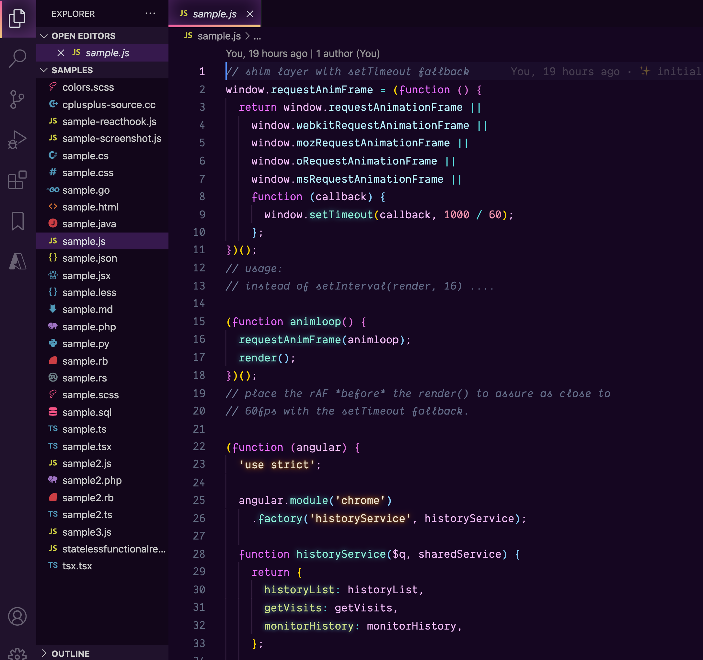

# Fortnite VS Code Theme

🐔 Are you a child at heart? Do you like enjoying yourself, even while writing serious business logic? If you like taking a flame bow and igniting data structures on fire, this is the theme for you.

🏹 Enjoy it before I get a cease and desist!

This theme is inspired by Fortnite, which is a game that's basically like the Hunger Games set at children's birthday party in the middle of a fever dream. But more fun. Very cathartic for those of us in the tech industry.

Enjoy! ✨

## Installation

Install the [theme from the VS Marketplace](https://marketplace.visualstudio.com/items?itemName=sarah.drasner.fortnite-vscode-theme).

## Contributing

I'm very happy to consider any contributions to this theme. Before you make any changes, [please read the contribution guide](https://github.com/sdras/fortnite-vscode-theme/blob/master/CONTRIBUTING.md).

## Thanks

Thanks to [Robb Owen](https://twitter.com/Robb0wen), whose Synthwave theme truly inspired me.

Thanks also to [Mahmoud Ali](https://marketplace.visualstudio.com/publishers/akamud), whose Atom One Dark theme provided the basis for the samples included here.
